# 1. Shell编程前奏-小工具

## 1. 文本处理工具

### 1.1 grep工具

grep是**行**过滤工具；用于根据关键字进行行过滤

- 语法和选项

  ```shell
  # 1. 语法
  grep [选项] '关键字' 文件名
  
  # 2. 常见选项
  OPTIONS:
      -i: 不区分大小写
      -v: 查找不包含指定内容的行,反向选择
      -w: 按单词搜索
      -o: 打印匹配关键字
      -c: 统计匹配到的行数
      -n: 显示行号
      -r: 逐层遍历目录查找
      -A: 显示匹配行及后面多少行	
      -B: 显示匹配行及前面多少行
      -C: 显示匹配行前后多少行
      -l：只列出匹配的文件名
      -L：列出不匹配的文件名
      -e: 使用正则匹配
      -E:使用扩展正则匹配
      ^key:以关键字开头
      key$:以关键字结尾
      ^$:匹配空行
      --color=auto ：可以将找到的关键词部分加上颜色的显示, 不过一般的终端都已经具备这样的功能了
  ```

- 颜色设置

  ```shell
  # 临时设置,只针对当前终端和当前用户生效
  $ alias grep='grep --colour=auto'			
  
  # 永久设置：
  # 1）全局（针对所有用户生效）
  $ vim /etc/bashrc
  $ alias grep='grep --colour=auto'
  $ source /etc/bashrc
  
  # 2）局部（针对具体的某个用户）
  $ vim ~/.bashrc
  $ alias grep='grep --colour=auto'
  $ source ~/.bashrc
  ```

- 举例说明

  ```shell
  $ cat -n test.txt
       1  root:x:0:0:root:/Root:/bin/bash
       2  abc:bash:123
       3
       4  ftp:x:14:50:FTP User:/var/ftp:/sbin/nologin
       5  hello:Hello:helloWorld
       6  abc:root
       7  passwd:mail:email
       8  123:abc:456
       9  sdmc:aadd:45cvaa6
      10  shkflalldackfkal
  ```

  ```shell
  # 忽略大小写匹配包含root的行
  $ grep -i 'root' test.txt
  root:x:0:0:root:/Root:/bin/bash
  ```

  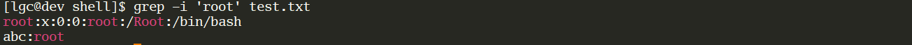

  ```shell
  # 精确匹配ftp单词
  $ grep -w ftp test.txt
  ```

  

  ```shell
  # 精确匹配hello单词
  $ grep -w hello test.txt 					
  ```

  

  ```shell
  # 打印匹配到的关键字ftp
  $ grep -wo ftp test.txt  						
  ```

  

  ```shell
  # 打印匹配到root关键字的行号
  $ grep -n root test.txt  						
  ```

  

  ```shell
  # 忽略大小写匹配统计包含关键字root的行
  $ grep -ni root test.txt  						
  ```

  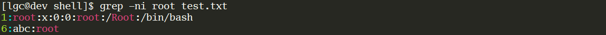

  ```shell
  # 忽略大小写匹配统计包含关键字root的行数
  $ grep -nic root test.txt						
  ```

  

  ```shell
  # 忽略大小写匹配以root开头的行
  $ grep -i ^root test.txt 					
  ```

  

  ```shell
  # 忽略大小写匹配不以以root开头的行
  $ grep -iv ^root test.txt 	
  ```

  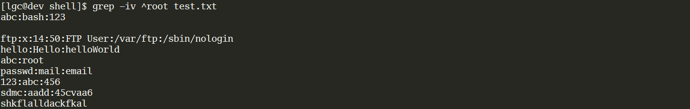

  ```shell
  # 匹配以bash结尾的行
  $ grep bash$ test.txt 						
  ```

  

  ```shell
  # 匹配空行并打印行号
  $ grep -n ^$ test.txt
  ```

  

  ```shell
  # 匹配包含mail关键字及其后3行
  $ grep -A 3 mail test.txt 				 	
  ```

  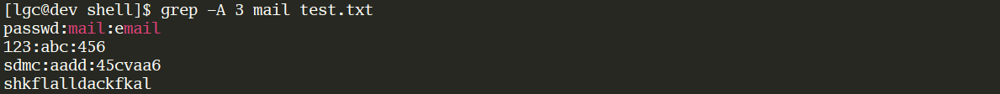

  ```shell
  # 匹配包含mail关键字及其前面3行
  $ grep -B 3 mail test.txt 
  ```

  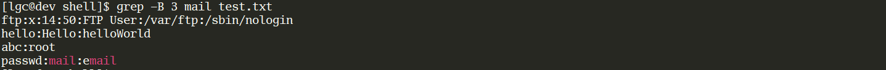

  ```shell
  # 匹配包含mail关键字及其前面和后面3行
  $ grep -C 3 mail test.txt 
  ```

  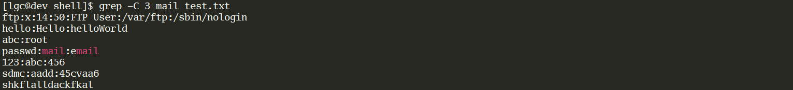

### 1.2 cut工具

cut是**列**截取工具，用于列的截取。

- 语法和选项

  ```shell
  # 1. 语法
  cut 选项  文件名
  
  # 2. 常见选项
  -c:	以字符为单位进行分割,截取
  -d:	自定义分隔符，默认为制表符\t
  -f:	与-d一起使用，指定截取哪个区域
  ```

- 举例说明

  ```shell
  $ cat -n cut.txt
       1  root:x:0:0:root:/Root:/bin/bash
       2  abc:bash:123
  ```

  ```shell
  # 以:冒号分割，截取第1列内容
  $ cut -d: -f1 cut.txt 			
  ```

  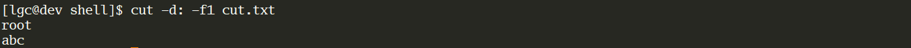

  ```shell
  # 以:冒号分割，截取第1,6,7列内容
  $ cut -d: -f1,6,7 cut.txt 	
  ```

  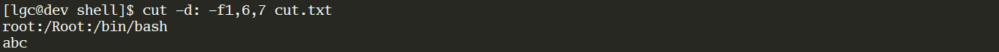

  ```shell
  # 截取文件中每行第4个字符
  $ cut -c4 cut.txt 				
  ```

  

  ```shell
  # 截取文件中每行的1-4个字符
  $ cut -c1-4 cut.txt 			
  ```

  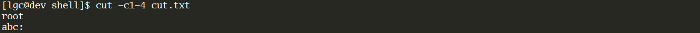

  ```shell
  # 从第5个字符开始截取后面所有字符
  $ cut -c5- cut.txt 				
  ```

  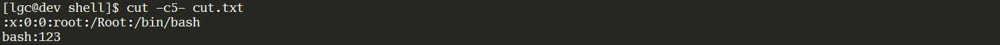

### 1.3 sort工具

sort工具用于排序;它将文件的每一行作为一个单位，从首字符向后，依次按ASCII码值进行比较，最后将他们按升序输出。

- 语法和选项

  ```shell
  # 1. 语法
  sort 选项  文件名
  
  # 2. 常见选项
  -u ：去除重复行
  -r ：降序排列，默认是升序
  -o : 将排序结果输出到文件中,类似重定向符号>
  -n ：以数字排序，默认是按字符排序
  -t ：分隔符
  	：对于特殊符号(如制表符)，可使用类似于-t$'\t'或-t'ctrl+v,tab'(先按ctrl+v，然后按tab键)的方法实现。
  -k ：第N列
  -b ：忽略前导空格。
  -R ：随机排序，每次运行的结果均不同
  ```

- 举例说明

  ```shell
  $ cat sort.txt
  1:mac:2000:500
  2:winxp:4000:300
3:bsd:1000:600
  4:linux:1000:200
  5:SUSE:4000:300
  ```
  
```shell
  # 不加任何选项时，将对整行从第一个字符开始依次向后直到行尾按照默认的字符集排序规则做升序排序, 1<2<3<4<5<6
  $ sort sort.txt
  ```
  
  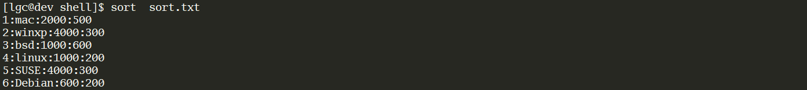
  
  ```shell
  # 以第三列为排序列进行排序, 默认第三列还是按照字符排序
$ sort -t: -k3 sort.txt
  ```
  
  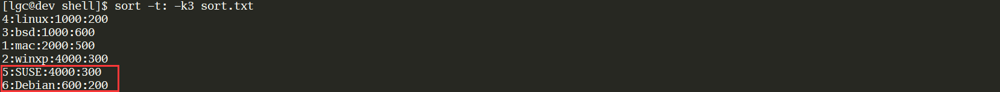
  
  ```shell
  # 对第三列按数值排序规则进行排序
  $ sort -t: -k3 -n sort.txt
  ```
  
  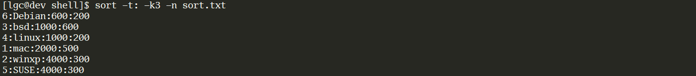
  
  ```shell
  # 在对第3列按数值排序规则排序的基础上，使用第四列作为决胜属性，且是以数值排序规则对第四列排序
  $ sort -t: -k3 -k4 -n sort.txt
  ```
  
  
  
  ```shell
  # 第3列按数值排序后，以第2列作为决胜列
  $ sort -t: -k3 -k2 -n sort.txt
  6:Debian:600:200
  3:bsd:1000:600
  4:linux:1000:200
  1:mac:2000:500
  2:winxp:4000:300
  5:SUSE:4000:300
  ```
  
  虽然得到了正确的结果，但这条命令是错误的。之所以最终得到了正确的结果，是因为**默认情况下，在命令行中指定的排序行为结束后，sort还会做最后一次排序，这最后一次排序是对整行按照完全默认规则进行排序的，也就是按字符集、升序排序。**由于1000所在的两行中的第一个字符3小于4，所以3排在前面。
  
  之所以说上面的语句是错误的，是因为第2列第一个字符是字母而不是数值，**在按数值排序时，字母是不可识别字符，一遇到不可识别字符就会立即结束该字段的排序行为。**可以使用"--debug"选项来查看排序的过程和排序时所使用的列。
  
  ```shell
  $ sort --debug -t: -k3 -k2 -n sort.txt
  sort: using ‘en_US.UTF-8’ sorting rules
  sort: key 1 is numeric and spans multiple fields
  sort: key 2 is numeric and spans multiple fields
  6:Debian:600:200
           ___
    ^ no match for key
  ________________
  3:bsd:1000:600
        ____
    ^ no match for key
  ______________
  4:linux:1000:200
          ____
    ^ no match for key
  ________________
  1:mac:2000:500
        ____
    ^ no match for key
  ______________
  2:winxp:4000:300
          ____
    ^ no match for key
  ________________
  5:SUSE:4000:300
         ____
    ^ no match for key
  ```
  
  ```shell
  # 在对第3列按数值排序规则排序的基础上，使用第2列作为决胜属性，且以默认排序规则对此列降序排序
  sort -t: -k3n -k2r sort.txt
  6:Debian:600:200
  4:linux:1000:200
  3:bsd:1000:600
  1:mac:2000:500
  2:winxp:4000:300
  5:SUSE:4000:300
  ```
  
  由于既要对第3列按数值升序排序，又要对第2列按默认规则降序排序，因此只能对每个字段单独分配选项。**注意，虽然"r"选项是降序结果，但它不影响排序过程，只影响最终排序结果。也就是说，在按照升序排序结束得到最终结果后，再反转第2列顺序，也就是得到了降序的结果。同样也说明，sort在排序的时候，一定且只能按照升序排序，只有排序动作结束了"r"选项才开始工作。**
  
  紧跟在字段后的选项(如"-k3n"的"n"和"-k2r"的"r")称为私有选项，使用短横线写在字段外的选项(如"-n"、"-r")为全局选项。**当没有为字段分配私有选项时，该排序字段将继承全局选项。**当然，只有像"-n"、"-r"这样的排序性的选项才能继承和分配给字段，"-t"这样的选项则无法分配。
  
  ```shell
  # 在对第3列按数值排序规则排序的基础上，使用第2列的第2个字符作为决胜属性，且以默认排序规则对此列升序排序
  $ sort -t: -k3n -k2.2,2.2 sort.txt
  6:Debian:600:200
  4:linux:1000:200
  3:bsd:1000:600
  1:mac:2000:500
  2:winxp:4000:300
  5:SUSE:4000:300
  ```
  
  其中"-k2.2,2.2"表示从第2个字段的第2个字符开始，到第2个字段的第2个字符结束，即严格限定为第2个字段第2个字符。如果需要对此字符降序排序，则"-k2.2,2.2r"。
  
  ```shell
  # 使用"-u"去除重复字段所在的行。例如第3列有两行1000，两行4000，去除字段重复的行时，将只保留排在前面的第一行
  $ sort -t: -k3n -u sort.txt
  6:Debian:600:200
  3:bsd:1000:600
  1:mac:2000:500
  2:winxp:4000:300
  ```
  
  由于需要去除重复字段的行，因此使用"-u"时将禁止sort做"最后一次排序"。
  
  ```shell
  # 将排序结果保存到文件中。即可以使用重定向，也可以使用"-o"选项.
  $ sort -t: -k3n -o sort1.txt sort.txt
  $ cat sort1.txt
  6:Debian:600:200
  3:bsd:1000:600
  4:linux:1000:200
  1:mac:2000:500
  2:winxp:4000:300
  5:SUSE:4000:300
  ```
  
  使用重定向不可保存到原文件，因为在sort开始执行前，原文件先被重定向截断。而使用"-o"则没有这样的问题，因为sort在打开文件前先完成数据的读取。但"-o"和"-m"一起使用时，同样不安全。
  
  ```shell
  # 使用"-c"或"-C"检测文件是否排过序
  $ sort -t: -c -k3n sort.txt ;echo $?
  sort: sort.txt:3: disorder: 3:bsd:1000:600
  1
  
  $ sort -t: -c -k3n sort1.txt ;echo $?
  0
  ```
  
  如果已排序，则不返回任何信息，退出状态码为0。如果未排序，退出状态码为1，但"-c"会给出诊断信息，并指明从哪一行开始乱序，而"-C"不返回任何信息。

### 1.4 uniq工具

uniq用于去除**连续**的**重复**行

- 语法和选项

  ```shell
  # 1.语法
  uniq 选项 文件
  
  # 2. 常见选项
  -i: 忽略大小写
  -c: 统计重复行次数
  -d: 只显示重复行
  ```

- 举例说明

  ```shell
  $ cat uniq.txt
  aaaaaaaaaa
  bbbbbbbbbb
  bbbbbbbbbB
  bbbbbbbbbb
  aaaaaaaaaa
  aaaaaaaaaaa
  ccccccccccccc
  ccccccccccccc
  ```

  ```shell
  # 不加选项
  $ uniq uniq.txt
  aaaaaaaaaa
  bbbbbbbbbb
  bbbbbbbbbB
  bbbbbbbbbb
  aaaaaaaaaa
  aaaaaaaaaaa
  ccccccccccccc
  
  # 忽略大小写 
  $ uniq -i uniq.txt
  aaaaaaaaaa
  bbbbbbbbbb
  aaaaaaaaaa
  aaaaaaaaaaa
  ccccccccccccc
  
  # 只显示重复行
  $ uniq -d uniq.txt
  ccccccccccccc
  
  # 只显示重复行并统计重复次数
  $ uniq -dc uniq.txt
        2 ccccccccccccc
  ```

### 1.5 tee工具

tee工具是从标准输入读取并写入到标准输出和文件，即：双向覆盖重定向（屏幕输出|文本输入）

- 语法和选项

  ```shell
  # 1. 语法
  tee 选项 文件
  
  # 常见选项
  -a 双向追加重定向
  ```

- 举例说明

  ```shell
  $ echo 'hello' | tee tee.txt
  hello
  $ cat tee.txt
  hello
  $ echo 'world' | tee tee.txt
  world
  $ cat tee.txt
  world
  $ echo 'hello' | tee -a tee.txt
  hello
  $ cat tee.txt
  world
  hello
  ```

### 1.6 diff工具

diff工具用于逐行比较文件的不同。diff描述两个文件不同的方式是告诉我们**怎样改变第一个文件之后与第二个文件匹配**。

- 语法和选项

  ```shell
  # 1. 语法
  diff [选项] 文件1 文件2
  
  # 常见选项
  -b	不检查空格	
  -B	不检查空白行	
  -i	不检查大小写	
  -w	忽略所有的空格	
  --normal	正常格式显示(默认)	
  -c	上下文格式显示	
  -u	合并格式显示
  ```

- 举例说明

  ```shell
  # 文件准备
  $ cat diff1.txt
  aaaa
  111
  hello world
  222
  333
  bbb
  
  $ cat diff2.txt
  aaa
  hello
  111
  222
  bbb
  333
  world
  
  # 正常显示
  $ diff diff1.txt diff2.txt
  1c1,2					第一个文件的第1行需要改变(c=change)才能和第二个文件的第1到2行匹配			
  < aaaa				小于号"<"表示左边文件(file1)文件内容
  ---					---表示分隔符
  > aaa					大于号">"表示右边文件(file2)文件内容
  > hello
  3d3					第一个文件的第3行删除(d=delete)后才能和第二个文件的第3行匹配
  < hello world
  5d4					第一个文件的第5行删除后才能和第二个文件的第4行匹配
  < 333
  6a6,7					第一个文件的第6行增加(a=add)内容后才能和第二个文件的第6到7行匹配
  > 333					需要增加的内容在第二个文件里是333和world
  > world
  
  # 上下文格式显示
  $ diff -c diff1.txt diff2.txt
  前两行主要列出需要比较的文件名和文件的时间戳；文件名前面的符号***表示file1，---表示file2
  *** file1       2021-06-17 10:11:46.756530881 +0800
  --- file2       2021-06-17 10:11:31.206309870 +0800
  ***************	我是分隔符
  *** 1,6 ****		以***开头表示file1文件，1,6表示1到6行
  ! aaaa				!表示该行需要修改才与第二个文件匹配
    111
  - hello world		-表示需要删除该行才与第二个文件匹配
    222
  - 333					-表示需要删除该行才与第二个文件匹配
    bbb
  --- 1,7 ----		以---开头表示file2文件，1,7表示1到7行
  ! aaa					表示第一个文件需要修改才与第二个文件匹配
  ! hello				表示第一个文件需要修改才与第二个文件匹配
    111
    222
    bbb
  + 333					表示第一个文件需要加上该行才与第二个文件匹配
  + world				表示第一个文件需要加上该行才与第二个文件匹配
  
  # 合并格式显示
  $ diff -u diff1.txt diff2.txt
  --- diff1.txt   2021-06-17 10:11:46.756530881 +0800
  +++ diff2.txt   2021-06-17 10:11:31.206309870 +0800
  @@ -1,6 +1,7 @@
  -aaaa
  +aaa
  +hello
   111
  -hello world
   222
  -333
   bbb
  +333
  +world
  ```

  ```shell
  # 比较两个目录不同
  $ diff dir1 dir2
  diff dir1/file1 dir2/file1
  0a1
  > hello
  Only in dir1: file3
  Only in dir2: test1
  
  # 如果只需要比较两个目录里文件的不同，不需要进一步比较文件内容，需要加-q选项
  $ diff -q dir1 dir2
  Files dir1/file1 and dir2/file1 differ
  Only in dir1: file3
  Only in dir2: test1
  ```

  有时候我们需要以一个文件为标准，去修改其他文件，并且修改的地方较多时，我们可以通过打补丁的方式完成。

  ```shell
  # 1）先找出文件不同，然后输出到一个文件
  $ diff -uN file1 file2 > file.patch
  -u:上下文模式
  -N:将不存在的文件当作空文件
  
  # 2）将不同内容打补丁到文件
  $ patch file1 file.patch
  patching file file1
  
  # 3）测试验证
  $ diff file1 file2
  [root@MissHou ~]#
  ```

### 1.7 paste工具

paste工具用于合并文件行。

- 语法和选项

  ```shell
  # 1. 语法
  paste 选项 文件
  
  # 2. 常用选项
  -d：自定义间隔符，默认是tab
  -s：串行处理，非并行
  ```

- 举例说明

  ```shell
  # 文件准备
  $ cat paste1.txt
  a1
  a2
  a3
  a4
  a5
  $ cat paste2.txt
  b1
  b2
  b3
  b4
  b5
  $ cat paste3.txt
  c1
  c2
  c3
  c4
  c5
  
  # 合并两个文件，默认分隔符为tab键或者空格
  $ paste paste1.txt paste2.txt
  a1      b1
  a2      b2
  a3      b3
  a4      b4
  a5      b5
  
  # 指定先后合并
  $ paste paste2.txt paste1.txt
  b1      a1
  b2      a2
  b3      a3
  b4      a4
  b5      a5
  
  # 指定分隔符合并
  $ paste -d@ paste1.txt paste2.txt
  a1@b1
  a2@b2
  a3@b3
  a4@b4
  a5@b5
  
  # 可以合并多个文件
  $ paste paste1.txt paste2.txt paste3.txt
  a1      b1      c1
  a2      b2      c2
  a3      b3      c3
  a4      b4      c4
  a5      b5      c5
  
  # 指定多个分割符的情况，会依次排列使用
  $ paste -d@# paste1.txt paste2.txt paste3.txt
  a1@b1#c1
  a2@b2#c2
  a3@b3#c3
  a4@b4#c4
  a5@b5#c5
  
  # 直接从管道符中提取数据
  $ ls
  cut.txt  diff1.txt  diff2.txt  grep.txt  paste1.txt  paste2.txt  paste3.txt  sort1.txt  sort.txt  tee.txt  uniq.txt
  
  $ ls | paste -d" " # 默认情况一行只有一个数据
  cut.txt
  diff1.txt
  diff2.txt
  grep.txt
  paste1.txt
  paste2.txt
  paste3.txt
  sort1.txt
  sort.txt
  tee.txt
  uniq.txt
  
  $ ls | paste -d" " - - - -  # 指定每行中含有元素的个数
  cut.txt diff1.txt diff2.txt grep.txt
  paste1.txt paste2.txt paste3.txt sort1.txt
  sort.txt tee.txt uniq.txt
  
  $ ls | paste -s  # 一行显示参数
  cut.txt diff1.txt       diff2.txt       grep.txt        paste1.txt      paste2.txt      paste3.txt      sort1.txt       sort.txt        tee.txt uniq.txt
  ```

### 1.8 tr工具

tr用于字符转换，替换和删除；主要用于删除文件中控制字符或进行字符转换。

- 语法和选项

  ```shell
  # 1. 语法
  用法1：命令的执行结果交给tr处理，其中string1用于查询，string2用于转换处理
  
   commands|tr  'string1'  'string2'
  
  用法2：tr处理的内容来自文件，记住要使用"<"标准输入
  
   tr  'string1'  'string2' < filename
  
  用法3：匹配string1进行相应操作，如删除操作
  
   tr [options] 'string1' < filename
   
  # 2. 常用选项
  -d 删除字符串1中所有输入字符。
  -s 删除所有重复出现字符序列，只保留第一个；即将重复出现字符串压缩为一个字符串（一整行重复）
  
  # 3. 常匹配字符串
  字符串	              含义			备注
  a-z或[:lower:]	匹配所有小写字母	所有大小写和数字[a-zA-Z0-9]
  A-Z或[:upper:]	匹配所有大写字母	
  0-9或[:digit:]	匹配所有数字	
  [:alnum:]	    匹配所有字母和数字	
  [:alpha:]		匹配所有字母	
  [:blank:]		所有水平空白	
  [:punct:]		匹配所有标点符号	
  [:space:]		所有水平或垂直的空格	
  [:cntrl:]		所有控制字符			\f Ctrl-L 走行换页
  \n Ctrl-J 换行
  ```

- 举例说明

  ```shell
  # 文件准备
  $ cat tr.txt
  ROOT:x:0:0:root:/root:/bin/bash
  bin:x:1:1:bin:/bin:/sbin/nologin
  daemon:x:2:2:daemon:/sbin:/sbin/nologin
  adm:x:3:4:adm:/var/adm:/sbin/nologin
  lp:x:4:7:lp:/var/spool/lpd:/sbin/nologin
  sync:x:5:0:sync:/sbin:/bin/sync
  shutdown:x:6:0:shutdown:/sbin:/sbin/shutdown
  halt:x:7:0:halt:/sbin:/sbin/halt
  mail:x:8:12:mail:/var/spool/mail:/sbin/nologin
  uucp:x:10:14:uucp:/var/spool/uucp:/sbin/nologin
  boss02:x:516:511::/home/boss02:/bin/bash
  vip:x:517:517::/home/vip:/bin/bash
  stu1:x:518:518::/home/stu1:/bin/bash
  mailnull:x:47:47::/var/spool/mqueue:/sbin/nologin
  smmsp:x:51:51::/var/spool/mqueue:/sbin/nologin
  aaaaaaaaaaaaaaaaaaaa
  bbbbbb111111122222222222233333333cccccccc
  hello world 888
  666
  777
  999
  
  # 删除文件中的:和/
  $ tr -d '[:/]' < tr.txt
  ROOTx00rootrootbinbash
  binx11binbinsbinnologin
  daemonx22daemonsbinsbinnologin
  admx34admvaradmsbinnologin
  lpx47lpvarspoollpdsbinnologin
  syncx50syncsbinbinsync
  shutdownx60shutdownsbinsbinshutdown
  haltx70haltsbinsbinhalt
  mailx812mailvarspoolmailsbinnologin
  uucpx1014uucpvarspooluucpsbinnologin
  boss02x516511homeboss02binbash
  vipx517517homevipbinbash
  stu1x518518homestu1binbash
  mailnullx4747varspoolmqueuesbinnologin
  smmspx5151varspoolmqueuesbinnologin
  aaaaaaaaaaaaaaaaaaaa
  bbbbbb111111122222222222233333333cccccccc
  hello world 888
  666
  777
  999
  
  # 删除文件中的:和/
  $ cat tr.txt | tr -d '[:/]'
  ROOTx00rootrootbinbash
  binx11binbinsbinnologin
  daemonx22daemonsbinsbinnologin
  admx34admvaradmsbinnologin
  lpx47lpvarspoollpdsbinnologin
  syncx50syncsbinbinsync
  shutdownx60shutdownsbinsbinshutdown
  haltx70haltsbinsbinhalt
  mailx812mailvarspoolmailsbinnologin
  uucpx1014uucpvarspooluucpsbinnologin
  boss02x516511homeboss02binbash
  vipx517517homevipbinbash
  stu1x518518homestu1binbash
  mailnullx4747varspoolmqueuesbinnologin
  smmspx5151varspoolmqueuesbinnologin
  aaaaaaaaaaaaaaaaaaaa
  bbbbbb111111122222222222233333333cccccccc
  hello world 888
  666
  777
  999
  
  # 将文件中的数字替换为@符号
  $ tr '[0-9]' '@' < tr.txt
  ROOT:x:@:@:root:/root:/bin/bash
  bin:x:@:@:bin:/bin:/sbin/nologin
  daemon:x:@:@:daemon:/sbin:/sbin/nologin
  adm:x:@:@:adm:/var/adm:/sbin/nologin
  lp:x:@:@:lp:/var/spool/lpd:/sbin/nologin
  sync:x:@:@:sync:/sbin:/bin/sync
  shutdown:x:@:@:shutdown:/sbin:/sbin/shutdown
  halt:x:@:@:halt:/sbin:/sbin/halt
  mail:x:@:@@:mail:/var/spool/mail:/sbin/nologin
  uucp:x:@@:@@:uucp:/var/spool/uucp:/sbin/nologin
  boss@@:x:@@@:@@@::/home/boss@@:/bin/bash
  vip:x:@@@:@@@::/home/vip:/bin/bash
  stu@:x:@@@:@@@::/home/stu@:/bin/bash
  mailnull:x:@@:@@::/var/spool/mqueue:/sbin/nologin
  smmsp:x:@@:@@::/var/spool/mqueue:/sbin/nologin
  aaaaaaaaaaaaaaaaaaaa
  bbbbbb@@@@@@@@@@@@@@@@@@@@@@@@@@@cccccccc
  hello world @@@
  @@@
  @@@
  @@@
  
  # 将文件中的小写字母替换成大写字母
  $ tr '[a-z]' '[A-Z]' < tr.txt
  ROOT:X:0:0:ROOT:/ROOT:/BIN/BASH
  BIN:X:1:1:BIN:/BIN:/SBIN/NOLOGIN
  DAEMON:X:2:2:DAEMON:/SBIN:/SBIN/NOLOGIN
  ADM:X:3:4:ADM:/VAR/ADM:/SBIN/NOLOGIN
  LP:X:4:7:LP:/VAR/SPOOL/LPD:/SBIN/NOLOGIN
  SYNC:X:5:0:SYNC:/SBIN:/BIN/SYNC
  SHUTDOWN:X:6:0:SHUTDOWN:/SBIN:/SBIN/SHUTDOWN
  HALT:X:7:0:HALT:/SBIN:/SBIN/HALT
  MAIL:X:8:12:MAIL:/VAR/SPOOL/MAIL:/SBIN/NOLOGIN
  UUCP:X:10:14:UUCP:/VAR/SPOOL/UUCP:/SBIN/NOLOGIN
  BOSS02:X:516:511::/HOME/BOSS02:/BIN/BASH
  VIP:X:517:517::/HOME/VIP:/BIN/BASH
  STU1:X:518:518::/HOME/STU1:/BIN/BASH
  MAILNULL:X:47:47::/VAR/SPOOL/MQUEUE:/SBIN/NOLOGIN
  SMMSP:X:51:51::/VAR/SPOOL/MQUEUE:/SBIN/NOLOGIN
  AAAAAAAAAAAAAAAAAAAA
  BBBBBB111111122222222222233333333CCCCCCCC
  HELLO WORLD 888
  666
  777
  999
  
  # 匹配小写字母并将重复的压缩为一个
  $ tr -s '[a-z]' < tr.txt
  ROOT:x:0:0:rot:/rot:/bin/bash
  bin:x:1:1:bin:/bin:/sbin/nologin
  daemon:x:2:2:daemon:/sbin:/sbin/nologin
  adm:x:3:4:adm:/var/adm:/sbin/nologin
  lp:x:4:7:lp:/var/spol/lpd:/sbin/nologin
  sync:x:5:0:sync:/sbin:/bin/sync
  shutdown:x:6:0:shutdown:/sbin:/sbin/shutdown
  halt:x:7:0:halt:/sbin:/sbin/halt
  mail:x:8:12:mail:/var/spol/mail:/sbin/nologin
  ucp:x:10:14:ucp:/var/spol/ucp:/sbin/nologin
  bos02:x:516:511::/home/bos02:/bin/bash
  vip:x:517:517::/home/vip:/bin/bash
  stu1:x:518:518::/home/stu1:/bin/bash
  mailnul:x:47:47::/var/spol/mqueue:/sbin/nologin
  smsp:x:51:51::/var/spol/mqueue:/sbin/nologin
  a
  b111111122222222222233333333c
  helo world 888
  666
  777
  999
  ```

## 2. Bash的特性

### 2.1 命令和文件自动补全

Tab只能补全命令和文件 （RHEL6/Centos6）

### 2.2 常见的快捷键

```shell
^c   			终止前台运行的程序
^z	  			将前台运行的程序挂起到后台
^d   			退出 等价exit
^l   			清屏 
^a |home  	光标移到命令行的最前端
^e |end  	光标移到命令行的后端
^u   			删除光标前所有字符
^k   			删除光标后所有字符
^r	 			搜索历史命令
```

### 2.3 常用的通配符（重点）

```shell
*:	匹配0或多个任意字符
?:	匹配任意单个字符
[list]:	匹配[list]中的任意单个字符,或者一组单个字符   [a-z]
[!list]: 匹配除list中的任意单个字符
{string1,string2,...}：匹配string1,string2或更多字符串

$ rm -f file*
$ cp *.conf  /dir1
$ touch file{1..5} # 创建file1 到 file5共5个文件
```

### 2.4 bash中的引号（重点）

- 双引号"" :会把引号的内容当成整体来看待，允许通过$符号引用其他变量值
- 单引号'' :会把引号的内容当成整体来看待，禁止引用其他变量值，shell中特殊符号都被视为普通字符
- 反撇号`` :反撇号和$()一样，引号或括号里的命令会优先执行，如果存在嵌套，反撇号不能用

```shell
$ echo "$(hostname)"
iZwz9gevtjvttgs6pxwrnyZ
$ echo '$(hostname)'
$(hostname)
$ echo "hello world"
hello world
$ echo 'hello world'
hello world

$ echo $(date +%F)
2021-06-17
$ echo `echo $(date +%F)`
2021-06-17
$ echo `date +%F`
2021-06-17
```

# 2. Shell编程之变量定义