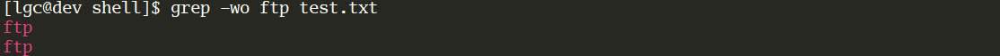
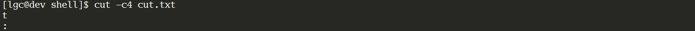

# 1. Shell编程前奏-小工具

## 1. 文本处理工具

### 1.1 grep工具

grep是**行**过滤工具；用于根据关键字进行行过滤

- 语法和选项

  ```shell
  # 1. 语法
  grep [选项] '关键字' 文件名
  
  # 2. 常见选项
  OPTIONS:
      -i: 不区分大小写
      -v: 查找不包含指定内容的行,反向选择
      -w: 按单词搜索
      -o: 打印匹配关键字
      -c: 统计匹配到的行数
      -n: 显示行号
      -r: 逐层遍历目录查找
      -A: 显示匹配行及后面多少行	
      -B: 显示匹配行及前面多少行
      -C: 显示匹配行前后多少行
      -l：只列出匹配的文件名
      -L：列出不匹配的文件名
      -e: 使用正则匹配
      -E:使用扩展正则匹配
      ^key:以关键字开头
      key$:以关键字结尾
      ^$:匹配空行
      --color=auto ：可以将找到的关键词部分加上颜色的显示, 不过一般的终端都已经具备这样的功能了
  ```

- 颜色设置

  ```shell
  # 临时设置,只针对当前终端和当前用户生效
  $ alias grep='grep --color=auto'			
  
  # 永久设置：
  # 1）全局（针对所有用户生效）
  $ vim /etc/bashrc
  $ alias grep='grep --color=auto'
  $ source /etc/bashrc
  
  # 2）局部（针对具体的某个用户）
  $ vim ~/.bashrc
  $ alias grep='grep --color=auto'
  $ source ~/.bashrc
  ```

- 举例说明

  ```shell
  $ cat -n test.txt
       1  root:x:0:0:root:/Root:/bin/bash
       2  abc:bash:123
       3
       4  ftp:x:14:50:FTP User:/var/ftp:/sbin/nologin
       5  hello:Hello:helloWorld
       6  abc:root
       7  passwd:mail:email
       8  123:abc:456
       9  sdmc:aadd:45cvaa6
      10  shkflalldackfkal
  ```

  ```shell
  # 忽略大小写匹配包含root的行
  $ grep -i 'root' test.txt
  root:x:0:0:root:/Root:/bin/bash
  ```

  

  ```shell
  # 精确匹配ftp单词
  $ grep -w ftp test.txt
  ```

  

  ```shell
  # 精确匹配hello单词
  $ grep -w hello test.txt 					
  ```

  

  ```shell
  # 打印匹配到的关键字ftp
  $ grep -wo ftp test.txt  						
  ```

  

  ```shell
  # 打印匹配到root关键字的行号
  $ grep -n root test.txt  						
  ```

  

  ```shell
  # 忽略大小写匹配统计包含关键字root的行
  $ grep -ni root test.txt  						
  ```

  

  ```shell
  # 忽略大小写匹配统计包含关键字root的行数
  $ grep -nic root test.txt						
  ```

  

  ```shell
  # 忽略大小写匹配以root开头的行
  $ grep -i ^root test.txt 					
  ```

  

  ```shell
  # 忽略大小写匹配不以以root开头的行
  $ grep -iv ^root test.txt 	
  ```

  

  ```shell
  # 匹配以bash结尾的行
  $ grep bash$ test.txt 						
  ```

  

  ```shell
  # 匹配空行并打印行号
  $ grep -n ^$ test.txt
  ```

  

  ```shell
  # 匹配包含mail关键字及其后3行
  $ grep -A 3 mail test.txt 				 	
  ```

  

  ```shell
  # 匹配包含mail关键字及其前面3行
  $ grep -B 3 mail test.txt 
  ```

  

  ```shell
  # 匹配包含mail关键字及其前面和后面3行
  $ grep -C 3 mail test.txt 
  ```

  

### 1.2 cut工具

cut是**列**截取工具，用于列的截取。

- 语法和选项

  ```shell
  # 1. 语法
  cut 选项  文件名
  
  # 2. 常见选项
  -c:	以字符为单位进行分割,截取
  -d:	自定义分隔符，默认为制表符\t
  -f:	与-d一起使用，指定截取哪个区域
  ```

- 举例说明

  ```shell
  $ cat -n cut.txt
       1  root:x:0:0:root:/Root:/bin/bash
       2  abc:bash:123
  ```

  ```shell
  # 以:冒号分割，截取第1列内容
  $ cut -d: -f1 cut.txt 			
  ```

  

  ```shell
  # 以:冒号分割，截取第1,6,7列内容
  $ cut -d: -f1,6,7 cut.txt 	
  ```

  

  ```shell
  # 截取文件中每行第4个字符
  $ cut -c4 cut.txt 				
  ```

  

  ```shell
  # 截取文件中每行的1-4个字符
  $ cut -c1-4 cut.txt 			
  ```

  

  ```shell
  # 从第5个字符开始截取后面所有字符
  $ cut -c5- cut.txt 				
  ```

  

### 1.3 sort工具

sort工具用于排序;它将文件的每一行作为一个单位，从首字符向后，依次按ASCII码值进行比较，最后将他们按升序输出。

- 语法和选项

  ```shell
  # 1. 语法
  sort 选项  文件名
  
  # 2. 常见选项
  -u ：去除重复行
  -r ：降序排列，默认是升序
  -o : 将排序结果输出到文件中,类似重定向符号>
  -n ：以数字排序，默认是按字符排序
  -t ：分隔符
  	：对于特殊符号(如制表符)，可使用类似于-t$'\t'或-t'ctrl+v,tab'(先按ctrl+v，然后按tab键)的方法实现。
  -k ：第N列
  -b ：忽略前导空格。
  -R ：随机排序，每次运行的结果均不同
  ```

- 举例说明

  ```shell
  # 不加任何选项时，将对整行从第一个字符开始依次向后直到行尾按照默认的字符集排序规则做升序排序, 1<2<3<4<5<6
  $ sort sort.txt
  ```

  
  
  ```shell
  # 以第三列为排序列进行排序, 默认第三列还是按照字符排序
  $ sort -t: -k3 sort.txt
  ```
  
  
  
  ```shell
    # 对第三列按数值排序规则进行排序
    $ sort -t: -k3 -n sort.txt
  ```

  

### 1.4 uniq工具

### 1.5 tee工具

### 1.6 diff工具

### 1.7 paste工具

### 1.8 tr工具

## 2. Bash的特性

